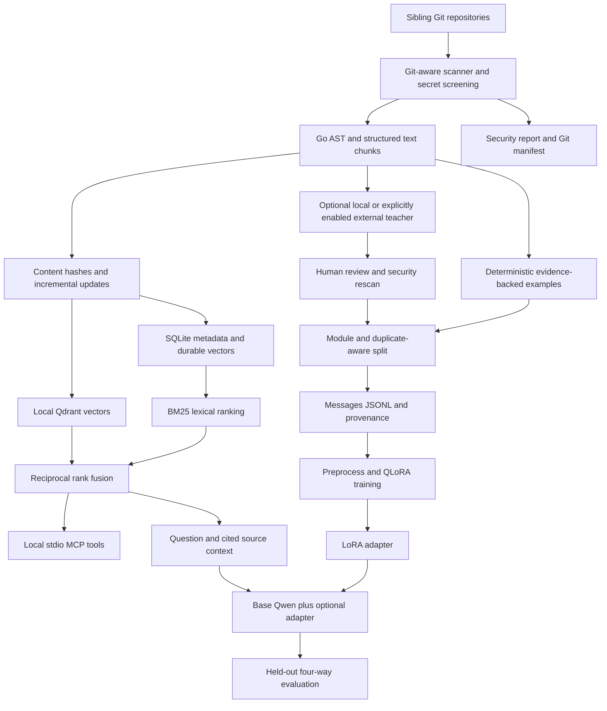

# qwen-codebase-trainer

A local Python 3.11+ pipeline for sibling Git repositories. It builds a source retrieval index and prepares supervised Qwen QLoRA training through Axolotl. It never starts training as part of scanning, indexing, dataset generation, or validation.

Fine-tuning teaches coding conventions, recurring reasoning patterns, style, and domain behavior. RAG supplies current source, exact function locations, changing business rules, and repository knowledge. Adapter weights are not a current-source database. No model-quality improvement is claimed before evaluation.



## Quick start

Run these commands from this project. Source repositories remain in place. Git must be installed. The lightweight setup does not require CUDA, model downloads, or an API key.

1. **Create an environment.** Python 3.11 or 3.12 is recommended for the broader ML ecosystem.

   ```bash
   python3.11 -m venv .venv
   source .venv/bin/activate
   ```

2. **Install dependencies and configure.**

   ```bash
   python -m pip install -e '.[dev]'
   cp .env.example .env
   set -a
   source .env
   set +a
   ```

   `.env` is deliberately not loaded implicitly. `WORKSPACE_ROOT` defaults to this project's parent, `/home/toan/src/payment-src` in this workspace. Use an absolute value when launching from other directories. `DATA_DIR` and `ARTIFACTS_DIR` default to project-local directories. Runtime artifacts are ignored by Git and may contain proprietary source excerpts.

3. **Check the GPU.**

   ```bash
   python scripts/check_gpu.py
   ```

   Reports NVIDIA model/VRAM, driver-supported CUDA version, PyTorch CUDA version/availability, bf16, and conservative model/batch/sequence recommendations. Driver CUDA is not the installed PyTorch runtime. Without PyTorch, usability and bf16 are unverified. A 12 GiB card should start with `BASE_MODEL=Qwen/Qwen3-4B SEQUENCE_LEN=1024`, micro batch 1. The project default remains `Qwen/Qwen3-8B`; budget at least roughly 16 GiB, preferably 24 GiB, and verify actual peak memory.

4. **Scan repositories.**

   ```bash
   python -m src.cli scan
   ```

   Inspect `artifacts/security-scan.json` and `artifacts/scan-manifest.jsonl`. Set `INCLUDE_BLAME=true` to collect line-to-commit mappings; author identities are omitted. The manifest records current repository HEAD, working-tree content hash, and screened recent commit subjects. Uncommitted changes are indexed from the working tree; HEAD is provenance, not a claim that content matches that commit.

5. **Build retrieval and query it.**

   ```bash
   python -m src.cli index
   python -m src.cli search "how is payment idempotency implemented?"
   python -m src.cli search "transaction commit" --mode lexical --top-k 3
   python -m src.cli search "transaction commit" --mode vector
   ```

   The default `EMBEDDING_MODEL=hashing-v1` is a deterministic, zero-download token-vector baseline. It exercises vector storage/search but is **not semantic embedding quality**. For semantic search:

   ```bash
   python -m pip install -e '.[embeddings]'
   export EMBEDDING_MODEL=sentence-transformers/all-MiniLM-L6-v2
   export ARTIFACTS_DIR="$PWD/artifacts/semantic"
   python -m src.cli index
   ```

   The first semantic-model load downloads public model weights; encoding runs locally and does not upload code. Pre-cache weights and set `HF_HUB_OFFLINE=1` for disconnected use. Long Go declarations remain whole and may exceed an embedding model's context, reducing recall. Select a longer-context code embedding model for large functions. Changing embedding/parser/security versions requires a new index directory; incompatible indexes fail explicitly.

6. **Generate and inspect supervised data.**

   ```bash
   python -m src.cli dataset
   python -m json.tool data/dataset-report.json
   head -n 2 data/train.jsonl
   head -n 2 data/validation.jsonl
   ```

   Outputs are OpenAI Messages JSONL plus `provenance.jsonl` and `split-manifest.json`. Offline generation produces conservative, verifiable declaration/documentation, direct-call, error/concurrency/transaction-construct, and location tasks. It does not fabricate business invariants, idempotency guarantees, or architectural explanations. Raw source is task evidence, not an unsupervised text-training corpus. This initial dataset is a baseline for inspection, not a claim of sufficient training quality.

   Broader function/module explanations, invariants, idempotency, data flow, conventions, architecture, new code patterns, and tests use the optional teacher/review workflow below. Review correctness, balance, duplicates, and sensitive content before training. Very small samples may have no validation module; preprocessing refuses an empty split. Generate more modules instead of moving individual examples across splits.

7. **Prepare the Axolotl training environment and preprocess.** Use a separate Python 3.11/3.12 CUDA environment to avoid changing the lightweight retrieval environment. Install a PyTorch/CUDA build compatible with your GPU, then Axolotl using its [installation instructions](https://docs.axolotl.ai/docs/installation.html). The exact Torch/CUDA/FlashAttention combination depends on your hardware, especially RTX 50-series GPUs.

   ```bash
   python3.12 -m venv .venv-train
   source .venv-train/bin/activate
   # Install the GPU-compatible PyTorch build per the official Axolotl guide first.
   python -m pip install packaging setuptools wheel ninja
   python -m pip install --no-build-isolation axolotl
   python -m pip install -e .
   python scripts/check_gpu.py
   make preprocess
   ```

   Preprocessing downloads/tokenizes the base model and is separate from training. Inspect `--debug` output for assistant-only masking and Qwen3 special tokens. Axolotl is intentionally not installed by the lightweight default dependency set. Pin the tested training environment with `pip freeze` after validating it on your GPU.

8. **Train QLoRA only when you choose.**

   ```bash
   BASE_MODEL=Qwen/Qwen3-4B SEQUENCE_LEN=1024 EPOCHS=2 make train
   # Optional, after completed training:
   make merge ADAPTER_PATH=outputs/qwen3-8b-lora
   ```

   The output directory name is configurable with `OUTPUT_DIR`; its default name does not change when you select a smaller base. Merging may require substantially more RAM than 4-bit training. Keep the base-model identity identical across training, merging, and inference.

9. **Run local inference.** In a CUDA environment with the inference dependencies:

   ```bash
   python -m pip install -e '.[inference]'
   python -m src.cli chat --base                     # base + retrieval
   ADAPTER_PATH=outputs/qwen3-8b-lora python -m src.cli chat
   make infer ADAPTER_PATH=outputs/qwen3-8b-lora
   python -m src.cli chat --no-rag --base --question "Explain Go interfaces"
   ```

   Default inference uses NF4 and greedy non-thinking generation. `INFERENCE_CONTEXT_TOKENS` and `MAX_NEW_TOKENS` control memory. Whole retrieved chunks are admitted within the tokenizer budget. The prompt requests source citations and abstention when evidence is missing; these are not guarantees of correct answers. `INFERENCE_4BIT=false` permits CPU inference with sufficient RAM.

10. **Start MCP.**

    ```bash
    python -m src.cli mcp
    ```

    This is a stdio server, so it waits for a client. Logs go to stderr. Ordinary tools do not load Qwen. Stop the server before indexing or using another process with the same local Qdrant directory; the project uses an exclusive lock with a 10-second timeout.

11. **Connect Claude Code.** Let Claude launch the server rather than starting a second copy:

    ```bash
    claude mcp add --scope local --transport stdio qwen-codebase \
      -- /absolute/path/qwen-codebase-trainer/.venv/bin/qwen-codebase mcp
    claude mcp list
    ```

    The editable installation and absolute executable make this independent of Claude's working directory. Pass absolute `ARTIFACTS_DIR`, `WORKSPACE_ROOT`, and matching `EMBEDDING_MODEL` through `--env` if customized. The default tools are `search_code(query, top_k)`, `find_symbol(symbol)`, `get_architecture_context(query)`, `find_similar_implementation(query)`, and `explain_code_context(query, summarize=false)`. Only `summarize=true` loads local Qwen. MCP tool results are given to the connected client; using a hosted Claude model can send those source snippets to its provider. The local teacher opt-in does not control Claude's data handling. See [Claude's MCP reference](https://code.claude.com/docs/en/mcp).

## Optional teacher and review workflow

Teacher generation is disabled by default. Neither scanning nor dataset generation calls it. Choose an in-process local Qwen teacher or a loopback OpenAI-compatible server:

```bash
TEACHER_PROVIDER=local python -m src.cli teacher --limit 14
# Or, with your local model server already running:
TEACHER_PROVIDER=openai-compatible \
TEACHER_BASE_URL=http://127.0.0.1:8000/v1 \
python -m src.cli teacher --limit 14
```

An external HTTPS endpoint additionally requires `ALLOW_EXTERNAL_TEACHER=true`, `TEACHER_BASE_URL`, `TEACHER_MODEL`, and optionally `TEACHER_API_KEY`. This explicitly permits proprietary prompt transfer. Redirects and environment proxies are disabled. The local endpoint is assumed to be under your control; a local proxy forwarding elsewhere is your responsibility. Teacher requests are bounded by `--limit`, use temperature zero, and are not guaranteed reproducible by remote providers.

`data/teacher-candidates.jsonl` is a review queue, not training input. Review each answer against its cited code, edit as needed, set `approved` to `true`, and provide a nonempty `reviewer`. For generated code/tests, check compilation and test behavior in an appropriate disposable checkout before approving. Import with:

```bash
python -m src.cli import-reviewed data/teacher-candidates.jsonl
```

The importer checks Messages structure, sensitive content, source hashes, duplicates, and the existing module split. Unapproved candidates are skipped. Re-running `dataset` regenerates the baseline and removes previously imported examples from train/validation; re-import still-current reviewed candidates afterward. Do not generate new evidence from held-out modules to support training examples.

## Training configuration and raw commands

`configs/qwen3-8b-qlora.yml` is the readable template. `training-config` resolves absolute paths, validates nonempty screened datasets, and writes `configs/generated.yml`. Supported environment settings include `BASE_MODEL`, `SEQUENCE_LEN`, `EPOCHS`, `MICRO_BATCH_SIZE`, `GRADIENT_ACCUMULATION_STEPS`, `LORA_R`, `LORA_ALPHA`, `LEARNING_RATE`, `OUTPUT_DIR`, and `FLASH_ATTENTION`. bf16 is selected when PyTorch reports support; otherwise CUDA uses fp16. Without Torch the template keeps `bf16: auto`, to be resolved in the real training environment. FlashAttention is opt-in after installing a compatible build; gradient checkpointing and micro batch 1 are the defaults.

Every other Axolotl setting can be supplied via a YAML override mapping:

```bash
python -m src.cli training-config --overrides configs/local-overrides.yml
axolotl preprocess configs/generated.yml --debug
axolotl train configs/generated.yml
axolotl merge-lora configs/generated.yml --lora-model-dir=outputs/qwen3-8b-lora
axolotl inference configs/generated.yml --lora-model-dir=outputs/qwen3-8b-lora
```

Overrides replace top-level keys; lists are replaced, not appended. `make config/preprocess/train` regenerates the config from environment/template, so run the raw commands after applying a custom override file. Qwen uses `chat_template: qwen3`, `type: chat_template`, `field_messages: messages`, and assistant-only loss. See [Axolotl Qwen3](https://docs.axolotl.ai/docs/models/qwen3.html), [conversation datasets](https://docs.axolotl.ai/docs/dataset-formats/conversation.html), and [CLI commands](https://docs.axolotl.ai/docs/cli.html).

## Incremental updates and parsing

Every indexing pass rescans eligible working-tree text for safety and hashes it. Only changed files are parsed and embedded; commit-only changes update metadata without changing vectors. Deleted or newly excluded files lose their chunks. SQLite stores repository/file identity, HEAD, content hash, chunks and vectors. Qdrant is the search projection; interrupted writes are replayed from saved vectors without rerunning the embedding model. This is a local, single-process design, not a multi-user service.

Go uses tree-sitter AST declarations with doc comments, functions, receiver-qualified methods, types, structs/interfaces, constants, imports, and package metadata. `CodeParser` is the small extension point. SQL/protobuf/YAML/JSON/Markdown/shell use structural section/statement boundaries with line windows for oversized text sections. They are not full language-semantic parsers. Oversized Go declarations are preserved for retrieval but excluded from small supervised prompts. Invalid Go fails with its file path rather than silently training on a malformed parse.

The split unit is repository + directory (module approximation). Connected modules containing identical nontrivial declarations are assigned together; exact chunk duplicates are emitted once. This prevents exact-duplicate leakage, not arbitrary semantic or near-duplicate leakage. Inspect provenance for duplicated business implementations before interpreting evaluation scores.

## Security and local data

The scanner uses Git's tracked and nonignored untracked file lists. It excludes `.git`, dependency/build directories, generated markers, binary/oversized files, symlinks, `.env*`, private-key/credential paths, state files, fixtures/testdata, dumps, and logs. Content rules reject entire files containing likely credentials, JWTs, private keys, secret-bearing URLs, Kubernetes secrets, literal IDs/customer data, opaque quoted values, shell environment assignments, or SQL data inserts. Reports contain rule names and line numbers, never matched values. This deliberately loses some useful examples rather than redacting code into incorrect semantics.

Heuristic screening cannot guarantee removal of every secret or customer datum. Review artifacts and adapt `src/security/scanner.py` to your organization before training or enabling external teachers. Security-rule changes must bump `VERSION` to invalidate existing indexes. New source files containing secrets are removed on the next full index update. Previously exported datasets/adapters cannot be retroactively cleaned by reindexing; regenerate datasets and retrain if sensitive content was included. Keep local artifacts private and do not commit them.

## Evaluation

```bash
python -m src.cli evaluate
# After real training, with matching base-model environment:
ADAPTER_PATH=outputs/qwen3-8b-lora python -m src.cli evaluate --compare
# Review claim counts in artifacts/evaluation-responses.jsonl, then:
python -m src.cli evaluate --reviewed artifacts/evaluation-responses.jsonl
```

The default evaluation generates file-location questions from validation provenance. `--questions path.jsonl` accepts curated cases (`id`, `question`, `expected_files`) for deeper architecture or behavior questions. Keep these cases held out from training. The four variants are A base, B base+RAG, C adapter, D adapter+RAG. Models load sequentially to avoid doubling VRAM. The runner records recall@5 for expected files, literal expected-file mentions in answers, and end-to-end response latency excluding model loading.

Groundedness and hallucination rate require claim-level review: set `reviewer`, `supported_claims`, `unsupported_claims`, and `contradicted_claims`. Groundedness is supported/total claims; hallucination rate is (unsupported+contradicted)/total. Missing review is `null`, never a fabricated zero. Review coverage is reported. These small location tests alone do not establish better coding ability; use paired, representative held-out tasks and inspect failures before claiming improvement.

## Development and layout

```bash
make check
python -m src.cli index --limit 30   # isolated artifacts/sample-index
python -m src.cli dataset --limit 60 # replaces dataset with a small inspection sample
```

The normal `search` command reads `artifacts/index`, not `sample-index`. Use the `Index` API for isolated sample tests, or build the full index. `make check` runs pytest, Ruff and mypy. GPU training, model/adapter generation, merging, semantic-model quality and four-way model evaluation must be validated separately on a compatible training stack.

```text
qwen-codebase-trainer/
├── README.md
├── pyproject.toml
├── .env.example
├── Makefile
├── configs/qwen3-8b-qlora.yml
├── src/
│   ├── cli.py, config.py, models.py, io.py
│   ├── scanner/repositories.py
│   ├── parser/chunks.py
│   ├── security/scanner.py
│   ├── dataset/generator.py, teacher.py
│   ├── retrieval/embeddings.py, index.py
│   ├── inference/qwen.py
│   ├── mcp/server.py
│   ├── training/configure.py, hardware.py
│   └── evaluation/runner.py
├── scripts/check_gpu.py
├── tests/
├── data/.gitkeep
└── artifacts/.gitkeep
```

## Validation in this workspace

The prepared `.venv` uses Python 3.11.16. Run `source .venv/bin/activate` to use it.
The validation run passed 43 tests, Ruff, and mypy (28 source files), including a real
MCP stdio client/server round trip. The scan accepted 759 files from 11 repositories;
the full index contains 3,841 chunks, and the baseline dataset contains 1,853 train
and 185 validation examples. A separate 44-file smoke test built 183 chunks and
confirmed that a repeated update embeds zero chunks. `scripts/smoke.py` reproduces
that bounded validation without replacing the main dataset.

See `artifacts/validation-summary.json`, `artifacts/checks.log`,
`artifacts/search-example.json`, `artifacts/retrieval-evaluation.json`, and
`artifacts/validated-environment.txt` for local evidence. Retrieval-only scores use
the hashing baseline and held-out location questions; they say nothing about
fine-tuning improvements. Qwen generation, Axolotl tokenizer preprocessing, GPU
training/merging, semantic embeddings, external teachers, and the four-way model
comparison were not run. NVIDIA driver inspection found an RTX 5070 with 11.94 GiB;
PyTorch is absent from the lightweight environment, so CUDA execution and bf16
remain unverified. No expensive training run was started.

## Completed local training run (2026-09-27)

A Qwen3-4B QLoRA adapter is now available at `outputs/qwen3-4b-lora`.
The run completed 99 updates (configured for two epochs) in 435 seconds of training,
using 790 training and 81 validation examples with location-only tasks excluded.
The final validation loss was 0.04889 versus 4.136 initially; this is a result on
this templated dataset, not evidence of general coding-quality improvement.
GPU utilization reached 99% during the validated workload.

The working configuration is `configs/qwen3-4b-local.yml`: bf16, batch 4,
gradient accumulation 4, sequence length 2048, grouped lengths, SDPA, and Liger
fused cross entropy. The ordinary batch-4 configuration exceeded VRAM on long
samples; the Liger configuration passed and completed the full run.
`make config` would replace generated settings, so preserve this dedicated config.

Use the existing training environment to load the adapter (avoids reinstalling or
downgrading its validated Transformers/CUDA stack):

```bash
cd /home/toan/src/payment-src/qwen-codebase-trainer
env -u PYTHONPATH BASE_MODEL=Qwen/Qwen3-4B \
  ADAPTER_PATH="$PWD/outputs/qwen3-4b-lora" \
  .venv-train/bin/python -m src.cli chat
```

`env -u PYTHONPATH` prevents the host Nix Python packages from leaking into the
Python 3.11 environment. See `artifacts/training-run/result.json`, `status.json`,
`train.log`, and `requirements.lock.txt` for the completed run and exact environment.
This later training run supersedes the earlier preparation-only validation notes
for CUDA training and model inference; merging and the four-way evaluation remain separate.

## Docker / Podman (CPU-only)

For machines without a usable CUDA GPU. `docker-compose.yml` mounts the sibling repositories
read-only at `/workspace`, hides this project from the scan, and writes to `data/`,
`artifacts/` and `outputs/`. `scripts/train_cpu.py` runs plain Transformers + PEFT LoRA
(fp32, no bitsandbytes/Axolotl) with assistant-only loss, and skips `location` tasks as the
GPU run did.

```bash
docker-compose build
docker-compose run --rm pipeline scan
docker-compose run --rm pipeline index
docker-compose run --rm pipeline dataset
docker-compose up -d train          # resumes from the latest checkpoint if present
podman logs -f qwen-codebase-trainer_train_1
```

Defaults: `BASE_MODEL=Qwen/Qwen3-0.6B`, `SEQUENCE_LEN=1024`, `EPOCHS=1`, micro batch 2 x
accumulation 8, `TORCH_THREADS=16`. On an i7-13700 with 16 GB RAM one epoch over 753
examples took 50 minutes (about 4 s per sample, peak about 3.5 GB RSS); validation loss went
from 2.33 to 0.079 on this templated dataset. Larger bases are much slower on
CPU and Qwen3-4B in fp32 does not fit in 16 GB. The adapter is written to
`outputs/qwen3-0.6b-lora-cpu` with `result.json`.

## Wikipedia → payment engineering dataset

The Wikipedia pipeline combines attributed source facts with screened patterns from the configured
payment repositories. It requires **at least 50% code-linked examples in every split**, not just
across the dataset. A linked example includes a real snippet, repository/path/symbol/line range,
commit and content hashes, an observed behavior, and a concrete engineering application.
AST call evidence and scenario-specific compatibility checks prevent unrelated file-name matches.
Test helpers are excluded from production evidence. Provider guarantees are never inferred from
an API name or deterministic request ID.

Install the base package and local semantic embedding dependency:

```bash
python -m pip install -e '.[embeddings,dev]'
python -m src.cli dataset wikipedia build --all
python -m src.cli dataset wikipedia validate --all --offline
```

On this machine the prepared training environment can run the pipeline:

```bash
env -u PYTHONPATH .venv-train/bin/python -m src.cli dataset wikipedia build --all --offline
```

Offline mode requires cached articles and the cached sentence-transformer model. The first online
build downloads public Wikipedia content and model weights; proprietary code is processed locally.
`datasets/payment_wikipedia_sources.json` lists 40 sources across eight categories and P0/P1/P2
priorities. Omit `--all` to fetch/process P0 only, use repeatable `--title` to select exact titles,
and use `--refresh` to update cached Wikipedia revisions. Each stage also runs independently:

```bash
python -m src.cli dataset wikipedia fetch --all
python -m src.cli dataset wikipedia process --all
python -m src.cli dataset wikipedia generate --offline
python -m src.cli dataset wikipedia validate --offline
```

`generate` uses the last processed source selection. `validate` reconstructs knowledge from cached
raw HTML, checks hashes, rescans current code, checks all provenance and messages exports, and
repeats semantic deduplication. It fails on stale or edited evidence. Raw article HTML is never
executed. Source facts are extractive; engineering interpretations and hypothetical failure
premises are separately labeled. The curated generator covers nine question types and 27
scenarios, including duplicate delivery/refunds, races, publish gaps, outages, replay and unsafe
designs. Extend the reviewed scenario library and compatibility rules to grow coverage; increasing
`--per-scenario` alone does not create useful diversity because equivalent scenarios are deduplicated.

Outputs:

- `data/raw/wikipedia/`: article HTML, revisions, attribution, license and fetch report.
- `data/processed/wikipedia/`: cleaned sections, semantic chunks, separated facts/interpretations,
  generation/validation reports and output hash manifest.
- `data/processed/payment_{train,validation,test}.jsonl`: instruction/input/output with full provenance.
- `data/processed/payment_{train,validation,test}.messages.jsonl`: chat-format exports for training.
- `artifacts/wikipedia/`: screened code inventory and manual sample review.

Deduplication uses local `sentence-transformers/all-MiniLM-L6-v2` cosine similarity (default .92),
with grounded candidates preferred. Hash-only embeddings do not satisfy validation. Source pages,
concept families, scenarios, shared code files and identical snippets form indivisible split groups.
The target is 80/10/10; small connected groups can make exact proportions impossible. Reports show
actual sizes. Grounding below 50%, leakage, missing evidence or fewer than three independent groups
fail the build. Short sections and indivisible sentences are marked as chunk-size exceptions;
token counts are estimates, not the training model's tokenizer.

This is a small curated seed dataset, not a claim that fine-tuning improves the model. Inspect the
sample and evaluate held-out tasks before expanding it. Use only the train messages export for
training, validation for tuning, and reserve test for final evaluation. This command prepares data;
it does not launch training or overwrite the existing `data/train.jsonl` or adapters.
Wikipedia material retains revision-specific attribution and CC BY-SA licensing metadata; local
code retains its existing ownership. Generated files containing proprietary snippets remain local
and git-ignored. Review licensing before redistributing a combined dataset.
